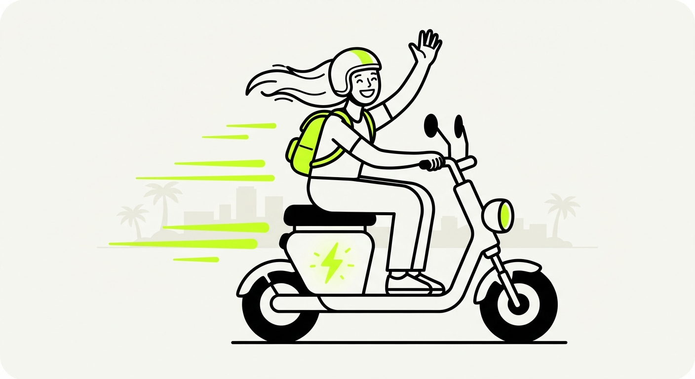
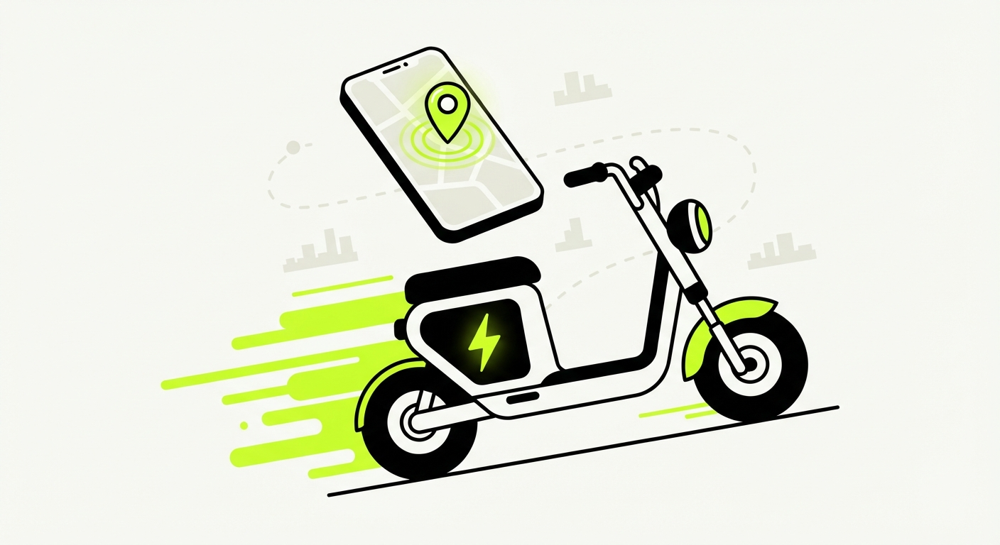
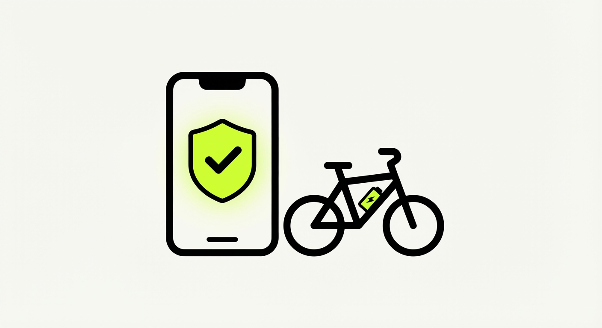

<div align="center">



# VoltVenture Design System

**The token infrastructure powering Vietnam's first passportless e-bike rental app.**

[](https://styledictionary.com)
[](https://reactnativepaper.com)
[](https://storybook.js.org)
[](https://www.w3.org/WAI/standards-guidelines/wcag/)
[](LICENSE)

[Overview](#overview) · [Design System](#design-system-architecture) · [Token Pipeline](#token-pipeline) · [Quick Start](#quick-start) · [Structure](#project-structure)

</div>

---

## Overview

**VoltVenture** is a mobile app (iOS/Android) solving the broken e-bike rental experience for tourists in Vietnam. The current ecosystem forces international travelers to surrender their **physical passports** as a security deposit — a massive trust barrier before a service is even used.

VoltVenture eliminates the passport requirement entirely through digital identity verification, transparent real-time billing, and curated safe-zone navigation — turning a high-anxiety rental into a seamless travel companion.

> **This repository** is the standalone design system package: a Style Dictionary v4 token pipeline that compiles W3C Design Token JSON into typed TypeScript constants and a React Native Paper MD3 theme. Storybook provides visual documentation for all token categories and component/screen designs. The React Native app that consumes this design system lives in a separate repository.

---

## The Problem We're Solving

Research with international tourists in Vietnam revealed five critical friction points:

| # | Problem | How VoltVenture Solves It |
|---|---------|--------------------------|
| 1 | **Passport as collateral** — Tourists must hand over physical passports | Digital ID scan + facial verification replaces physical documents entirely |
| 2 | **Range anxiety** — LED dot indicators cause panic mid-ride | Exact-kilometer battery telemetry + dynamic safe-zone map polygon |
| 3 | **Hidden fees** — Unexpected electricity charges destroy trust | Transparent real-time billing: base rental cost vs. electricity usage, separated |
| 4 | **Navigation safety** — One-handed riding with no phone mount | Curated offline-ready routes + pre-ride mount prompt; routes avoid highways |
| 5 | **Payment friction** — Cash-only shops, no international cards | Apple Pay, Google Wallet, Stripe/Adyen international card support |

---

## Design System Architecture

### Brand Identity

| Token | Value | Usage |
|-------|-------|-------|
| Volt Black | `#0F0F0F` | Primary surface, text on green |
| Electric Green | `#C6FF2D` | Single active verb per screen — buttons, CTAs, live states |
| Pure White | `#FFFFFF` | Content surfaces |
| Charcoal | `#1A1A1A` | Elevated dark surfaces |

> **Electric green rule:** `#C6FF2D` has 1.36:1 contrast against white — it is always a **background**. Text on green is always Volt Black (#0F0F0F). Green text is only used on dark surfaces (15.4:1, AAA).

### Three-Tier Token Architecture

```
Tier 1 — Primitive    green.500 = #C6FF2D
              ↓
Tier 2 — Semantic     color.action.primary → green.500
              ↓
Tier 3 — Component    button.primary.bg → color.action.primary
```

Components consume Semantic tokens only. No component ever references a Primitive directly.

### Token Categories (12 total)

| Category | What it defines |
|----------|----------------|
| **Color** | Volt Black, Electric Green, grey ramp (050–950), green ramp, semantic roles: surface / text / action / border / status |
| **Typography** | 14 type styles (display.xl → overline) — Manjari display, Inter body, JetBrains Mono code |
| **Spacing** | 11-step 4pt-base scale: `space.050` (2pt) → `space.1600` (64pt) |
| **Radius** | 7-step scale: `xs` (8pt) → `2xl` (36pt) + `full` (999pt). No `radius.none` — nothing in VoltVenture has a square corner |
| **Elevation** | 4 levels: flat / raised / floating / overlay (shadow model for light; lightness model for dark) |
| **Border** | 4 widths: none / hairline (1pt) / strong (1.5pt) / focus (2pt). Focus ring always Electric Green, 2pt offset |
| **Grid** | 4-column, 393pt reference, 16pt margin, 16pt gutter, 361pt content width |
| **Iconography** | 24pt canvas, 20pt live area, variants: 16/20/24/32pt |

---

## Token Pipeline



```
tokens/primitive/*.json    ← W3C DTCG JSON ($type / $value)
tokens/semantic/*.json     ← Alias references to primitives
        ↓
style-dictionary.config.mjs   ← SD v4 pipeline
  ├── Custom TS formatter
  ├── Dimension transform (unitless → dp)
  ├── Color/hex transform
  └── Shadow compose transform
        ↓
lib/voltventure_tokens.ts     ← Typed TypeScript constants (semantic exports)
lib/voltventure_theme.ts      ← createVoltVentureTheme() for React Native Paper MD3
generated/tokens.js           ← JS reference output for Storybook
```

### Built-in Validators (build-breaking)

| Validator | What it checks |
|-----------|---------------|
| WCAG AA contrast | All text/background token pairs pass 4.5:1 (normal) or 3:1 (large) |
| Electric green guard | `#C6FF2D` only used as background, never as foreground on light surfaces |
| 4pt grid | All spacing, sizing, and radius tokens are multiples of 4 |
| DTCG format | All token files use `$type` / `$value` (not bare `value`) |

---

## Quick Start

### Prerequisites

- Node.js 18+
- npm 7+ (workspace protocol support)

### Install & Build Tokens

```bash
# Clone the repo
git clone <repo-url>
cd "6. Design System"

# Install all workspace dependencies
npm install

# Validate tokens + run Style Dictionary pipeline
npm run build
```

### Storybook (Token Documentation)

```bash
npm run storybook
# Opens at http://localhost:6006
# 8 token category stories + 34 screen stories + 23 component stories
```

### Run Tests

```bash
# SD transform unit tests
npm test
```

---

## Hi-Fi Screen Gallery

All 34 Hi-Fi screens documented in Storybook — covering every user flow from onboarding through ride completion.

### Onboarding & Auth

<div align="center">
<table>
<tr>
<td align="center"><br/><sub>Splash</sub></td>
<td align="center"><br/><sub>Onboarding 1</sub></td>
<td align="center"><br/><sub>Onboarding 2</sub></td>
<td align="center"><br/><sub>Onboarding 3</sub></td>
</tr>
<tr>
<td align="center"><br/><sub>Login</sub></td>
<td align="center"><br/><sub>Registration</sub></td>
<td align="center"><br/><sub>ID Scan</sub></td>
<td align="center"><br/><sub>Facial Scan</sub></td>
</tr>
</table>
</div>

### Ride Flow

<div align="center">
<table>
<tr>
<td align="center"><br/><sub>Home Map</sub></td>
<td align="center"><br/><sub>Navigate to Bike</sub></td>
<td align="center"><br/><sub>QR Unlock</sub></td>
<td align="center"><br/><sub>Safety Mount</sub></td>
</tr>
<tr>
<td align="center"><br/><sub>Active Ride Dashboard</sub></td>
<td align="center"><br/><sub>Walking Directions</sub></td>
<td align="center"><br/><sub>End Ride / Find Charging</sub></td>
<td align="center"><br/><sub>Riding to Charging</sub></td>
</tr>
<tr>
<td align="center"><br/><sub>Ride Complete Summary</sub></td>
<td align="center"><br/><sub>Curated Routes</sub></td>
<td align="center"><br/><sub>Discover VIP Hubs</sub></td>
<td align="center"><br/><sub>Cafe Detail</sub></td>
</tr>
</table>
</div>

### Profile, Payments & History

<div align="center">
<table>
<tr>
<td align="center"><br/><sub>Ride History & Stats</sub></td>
<td align="center"><br/><sub>VoltCoins Rewards</sub></td>
<td align="center"><br/><sub>Profile</sub></td>
<td align="center"><br/><sub>Edit Profile</sub></td>
</tr>
<tr>
<td align="center"><br/><sub>Payment Methods</sub></td>
<td align="center"><br/><sub>Add Payment Method</sub></td>
<td align="center"><br/><sub>Select Payment</sub></td>
<td align="center"><br/><sub>Security Deposit</sub></td>
</tr>
</table>
</div>

### Settings & Support

<div align="center">
<table>
<tr>
<td align="center"><br/><sub>Settings</sub></td>
<td align="center"><br/><sub>Preferences</sub></td>
<td align="center"><br/><sub>Login & Security</sub></td>
<td align="center"><br/><sub>Support</sub></td>
</tr>
<tr>
<td align="center"><br/><sub>Privacy Policy</sub></td>
<td align="center"><br/><sub>Terms of Service</sub></td>
</tr>
</table>
</div>

---

## Project Structure

```
voltventure-design-system/
├── tokens/
│   ├── primitive/          # Tier 1: raw values (color, type, space…)
│   └── semantic/           # Tier 2: alias references
├── lib/
│   ├── voltventure_tokens.ts   # Generated TS constants
│   ├── voltventure_theme.ts    # createVoltVentureTheme() — RN Paper MD3
│   └── index.ts                # Barrel export
├── generated/
│   └── tokens.js               # JS reference for Storybook
├── stories/
│   ├── components/         # 23 component HTML stories
│   └── screens/            # 34 screen HTML stories
├── scripts/
│   └── validate-tokens.mjs # WCAG + grid + format validators
├── sd-transforms/          # Custom SD v4 transforms + unit tests
├── apps/                   # Reserved for future packages
├── style-dictionary.config.mjs
├── package.json            # Workspaces root
└── voltventure-foundations.html  # Design spec (canonical reference)
```

---

## Design Decisions

| Decision | Rationale |
|----------|-----------|
| **Style Dictionary v4** | W3C DTCG JSON native support (`$type`/`$value`); single pipeline to multiple outputs |
| **React Native Paper (MD3)** | Cross-platform iOS/Android; MD3 color roles map directly to VoltVenture's semantic token architecture |
| **No `radius.none` token** | Brand principle — nothing in VoltVenture has a square corner |
| **Storybook (HTML/CSS)** | Token docs are purely visual; no RN renderer needed, easier to host and share |
| **Electric green = background only** | 1.36:1 contrast against white fails every WCAG threshold; enforced at build time |
| **48dp touch targets** | Tuned for in-vehicle one-handed use; above iOS 44pt / Android 48dp platform floors |

---

## Accessibility

- All color pairs validated at build time against WCAG 2.1 AA (4.5:1 normal, 3:1 large text)
- Electric green usage enforced programmatically — cannot be used as light-surface foreground
- Minimum touch target floor: 48dp (above platform minimums, tuned for one-handed in-vehicle use)
- Tab-order and focus ring tokens defined for every interactive component

---

## Roadmap

| Item | Status |
|------|--------|
| Token pipeline (12 categories) | Complete |
| Storybook token docs (8 stories) | Complete |
| 34 screen Hi-Fi stories | Complete |
| 23 component stories | Complete |
| Hi-Fi screen gallery (34 screens) | Complete |
| React Native Paper showcase app | Abandoned — moved to separate repository |
| Dark mode token layer | Deferred — needs validated dark screen designs |
| Status colors (error / warning / info) | Deferred — awaiting brand decision |
| Figma Variables sync | Deferred — requires Figma file access |
| npm registry publication | Planned — validate locally first |

---

<div align="center">



**Built with Electric Green and Volt Black.**

*VoltVenture Design System — Token infrastructure for the future of tourist mobility in Vietnam.*

</div>
